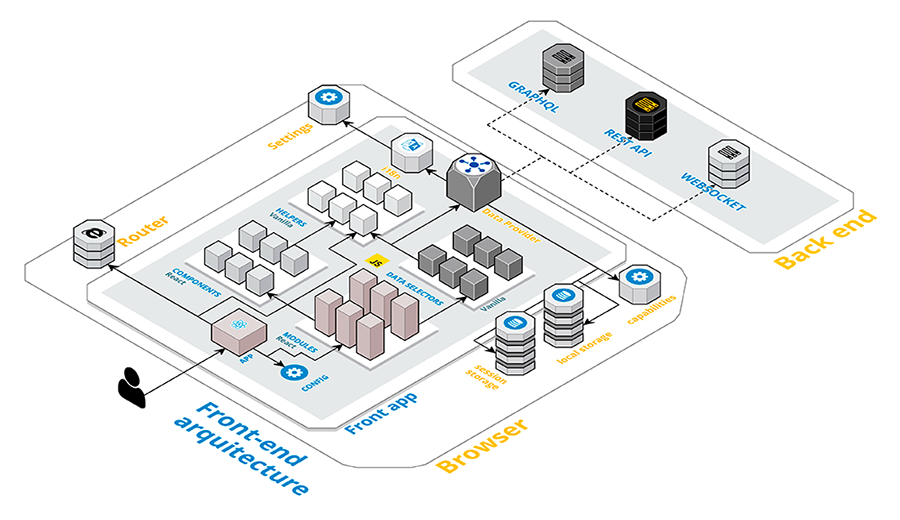
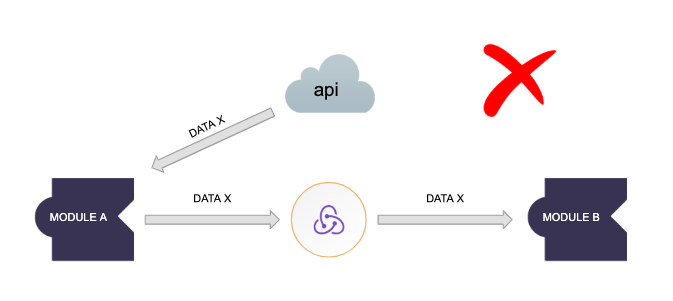
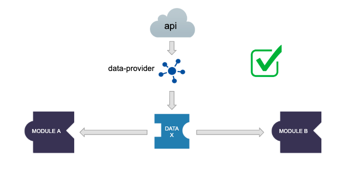
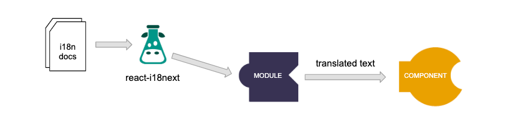
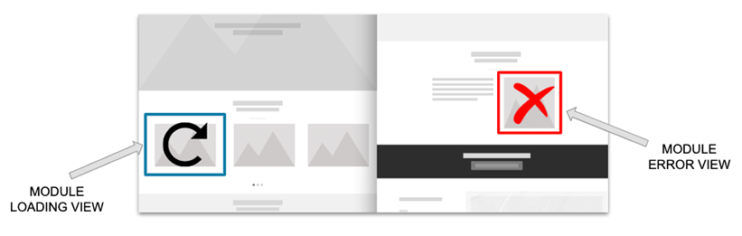

# Web UI

## Table of contents

* [Quick Start](#quick-start)
* [Arquitecture](#arquitecture)
  * [Requirements](#some-requirements)
  * [Modular approach](#modular-approach)
  * [Data model](#data-model)
  * [Brand customization](#brand-customization)
 

___
## A brief description

Multi brand web application for the reselling, installation, technical management and monitorization of virtual networks.

___
## Quick start

You should first read the [Architecture](#arquitecture) chapter before even cloning the repo, but, anyway... for sure that you want to start the application locally and see it running, don't you? 😉

```sh
git clone git@github.com
docker-compose run dev npm install
docker-compose run -p 3000:3000 dev npm start
```

...ok, you need also an API. Open another terminal window and run `docker-compose run -p 3100:3100 dev npm run mocks`.

## Local Quick Start
* First install node: https://nodejs.org/es/download/

* Then install dependencies:
```sh 
cd src
npm install
```
* Run mocks 
```sh 
npm run mocks
```

* Run front
```sh 
npm start
```

_
## Arquitecture

### Some requirements
___

- The application is intended to be used only by private members, so it has not specific SEO requirements because it hasn't public pages.
- As you can infere from the brief description, many different roles will use the application, so the UI will have to be adapted to all of them.
- This application will be used from many different countries, and each one may differ from the others in:
  - Api url (Data from one country will never be shared or used from another country)
  - Brand static assets (Brand logo, static documents customized for the brand, etc.)
  - Theme (Overall look, feel and style. _Static assets are not included here in order to allow the reusability of the same theme for many countries_)
  - Custom settings (Brand name, default fallback language, etc.)

### Modular approach
___

This project follows a __modular approach__, in which the __responsibility of each element is strictly defined in order to ensure its reusability__. Clear "boundary lines" are drawed between each type of element, and allowed dependencies between them are strictly defined.

#### Folders structure

In the project's `src` directory, you'll see four main folders:

* __`components`__: Contains components reused by elements from all domains. These elements can be considered as the `UI framework`, completely agnostic about the purpose of the app and the business rules. This is what we call our __components catalog__ or design system, and it is tested and deployed paralelly using [Storybook](#storybook). Internally, it is [organized using the Atomic Design methodology](#components-categorization).
* __`custom`__: Contains theme, settings and assets that can be customized during the build phase of the application to allow its reusability for multiple regions, brands, etc. Read the [brand customization](#brand-customization) chapter for further info.
* __`domains`__: Contains one folder for each business domain. Elements inside each domain are also categorized by its type, following the elements rules described in the next chapter. Each "domain" must have a clear business responsibility, and its dependencies should follow the same dependencies rules defined for the [data model](#data-model) in order to ensure a good isolation. So, changes in one domain should not impact to other domains. There are two "special" domains: "app", that can't be imported by any other one, as it is the entry point of the application, and "common", which can't import any other, as it should be usable by any other one.
* __`support`__: Contains helpers for development (`dev-utils`) and unit testing (`test-utils`). No one of these elements can be imported from any other element except from tests, or locally for debugging purposes.


#### Domains allowed dependencies

Next table defines which domains are allowed to depend on which ones:

|            | App | Common | Others | 
|------------|-----|------|---------| 
| App        | ✅   | ✅   | ✅      | 
| Common     | ⛔️  | ✅   | ⛔️    | 
| Others     | ⛔️  | ✅   | ✅      | 

> Horizontally, it means "Domain y can depend on domain x". Vertically, it means "Domain x can be dependency of domain y"

There are also more specific rules defining which type of elements can be imported between different domains. Read the  next section for further info.

#### Project elements

Inside each "domain", the elements are categorized by their level of coupling to the business rules and, consequently, by their level of abstraction and reusability.

[](docs/assets/front-end-architecture.png)

__Categorization of elements is__:

* __Components__ - `src/components/{atoms,molecules,organisms,templates,legacy}/*` Simple components, receiving all needed data through `props`. These elements are not allowed to connect by theirself to data domain in order to guarantee their reusability. These elements are not allowed to implement routers, as they belong to the "bussiness rules". Routers should be defined in "modules". These elements usually does not belong to any business domain, and should be able to be reused in all domains (and theoricaclly, even in other applications).
* __Modules__ - `src/modules/*` Should "connect" Components to the correspondant Domains. Modules can also contain "routers", and are at charge of the internationalization and other asynchronous stuff. There is an special module called "app" that is responsible of the application initialization, definition of main router and configuration of the other elements (`src/modules/app`)
* __Pages__ - `src/pages/*` Pure page definition. Not reusable parts. They will include a bunch of Modules.
* __Domain__ - `src/domains/[domain]/` Data origins, including states. Data modifications or combinations should be defined in these elements too, as well as actions or data validations.


#### Elements allowed dependencies

Next table defines which elements are allowed to depend on which ones:

|            | Domain | Modules | Components | Helpers |
|------------|--------|---------|------------|---------|
| Domain     | ✅     | ⛔️      | ⛔️         | ✅      |
| Modules    | ✅     | ✅      | ✅         | ✅      |
| Components | ⛔️     | ⛔️      | ✅         | ✅      |
| Pages      | ✅     | ✅      | ✅         | ✅      |

> Horizontally, it means "Element y can depend on element x". Vertically, it means "Element x can be dependency of element y"

There are also boundaries between elements belonging to different domains:

There are two exceptions to this last table:


#### Components categorization

Components are categorized following the [Atomic Design methodology](https://bradfrost.com/blog/post/atomic-web-design/), except for the `pages` level, because it usually implies defining routes, and this is responsibility of `modules` in our system (our components should be completely reusable, and defining routers imply coupling to business rules).

So, our components are divided into these categories:

* __atoms__: `src/components/atoms/*`. Just like in Chemistry, `atoms` are the smallest building blocks in our system. So, `atoms` are not allowed to import any other type of components.
* __molecules__: `src/components/molecules/*`. In the molecule stage, we take our independent atomic design elements, each with their own characteristics, style, format, and begin to bring them together into new groupings. So, `molecules` are only allowed to import `atoms`.
* __organisms__: `src/components/organisms/*`. As we enter the Organisms stage, our collections of atoms and molecules now become more complex than at the molecular level. `organisms` are allowed to import both `atoms`, `molecules` and even other `organisms`.
* __templates__: `src/components/templates/*` The template is the first stage of the Atomic Design methodology that does not align to a stage in the molecular world, but is important for Atomic Design. A template is where we begin to curate our organisms and other elements into a cohesive design. `templates` are allowed to import all of the other types of components.

##### Components allowed dependencies

Next table defines which components are allowed to depend on which ones:

|            | atoms | molecules | organisms | templates |
|------------|-------|-----------|-----------|-----------|
| atoms      | ⛔️    | ⛔️        | ⛔️        | ⛔️        |
| molecules  | ✅    | ⛔️        | ⛔️        | ⛔️        |
| organisms  | ✅    | ✅        | ✅        | ⛔️        |
| templates  | ✅    | ✅        | ✅        | ✅        |


> Horizontally, it means "Component of category y can depend on component of category x". Vertically, it means "Component of category x can be dependency of component of category y"


#### Providing data to components

__Components must be agnostic of data origins, they never should request data directly__. Modules are at charge of retrieving data and provide it to components. But even modules should not know about the origin of the data, they should always use abstract methods from "data" elements for retrieving or sending data.

The __usage of "states" for storing data that are not clearly "states" should be avoided__. A module should never assume that an specific data from the api was already loaded by another module and stored it in the "state", because this would make that module indirectly "dependant" on another ones, without an specific dependency. This is a type of "hidden" dependency that is strictly forbidden in order to ensure the independence and reusability of the modules.



To avoid these anti-patterns, Dedux Toolkit library is used for retrieving data__ from different data origins (such as api, localStorage, etc.). It also manage caches, retrieve data and refresh views when necessary, prepare specific queries depending of the type of data origin, etc.

As ["redux toolkit"](https://www.redux-toolkit.js.org) is at charge of managing caches, every module should always ask for the data that it needs using the correspondant data method. The cache is automatically clean when someone dispatches a "create", "update" or "delete" method over an specific data origin, so cleaning cache or refreshing data is not a problem of the modules.




#### Styles

Styles should be provided also in a modular way. Each component styles should never affect to other components. To achieve this, ["css-modules"](https://github.com/css-modules/css-modules) and ["Material UI styling"](https://material-ui.com/) solutions are used (with preference for the second one)

#### Routes

Components should never handle directly any route, as they can somehow be considered "business rules". Modules can handle routes, but first level routes should be handled only by the "main" module in the "app" domain, which is the responsible of loading the rest of modules.


#### Internationalization

Internationalization strongly depends of an specific internationalization library, and it implies asynchronous loads, so components should never directly use the internationalization helpers. Modules, which usually control the "loading" state, are the elements at charge of translating and providing translated strings to the components through the ["react-i18next"](https://react.i18next.com/) library.



Modules never use the `useTranslation` hook from the `react-i18next` library directly. Instead of that, a helper is created for each domain providing the appropiate "scope" and ensuring that modules from one domain are not using translation scopes from another one. [Read the internationalization tips for further info](#internalization-1)

#### Loading states and error handling

Loading states and error handling should be focused in the most granular way possible. At least, each module should handle their own loading or error states. Read the [guidelines chapter](#loading-states-and-error-handling-1) for further info.



### Data model

Please check the data model schema where all application domains and entities are described:

https://miro.com/app/board/uXjVPixhtu8=/

This data model is shared with the back-end team, and we try to keep it as most pure as possible.


* Every time a change is merged into the develop environment, the data model document has to be updated moving the correspondant proposal to the current state tab.

#### API

The api exposes almost purely all entities described in the schema, but take into account that foreign keys are represented without id suffix in the API, for example (read the schema annotations for further info).

The API accepts filtering by related entities. Simply use a "field__related-field" query string to build the filters (for example, requesting to `/services/services/?site__company=1` will return all services belonging to a site that belongs to the provided company)

There are some API endpoints not represented in the data model, as they are commands, or return composed data from various entities (this is not usual, and should be avoided, but sometimes is needed due to performance requirements or to avoid inter-domain dependencies). Please check the swagger documents to check all available API resources.)

### Brand customization
___

As it was mentioned in the [arquitecture requirements](#architecture), this project should be used by many different countries with different custom configurations, themes, etc.

To achieve this, environment variables are used to change the folders from where the specific brand resources are loaded. The application has to be built as many times as it is going to be distributed for different brands, but this process ensures that it is optimized for that specific brand, it never contains extra data related to other brands, and the total weight of the application will not increase if more brands are added.

Please read the [Customization section in the development chapter](#customization) for further info.

___

* Deactivate Chrome autocomplete in forms - It is a hard task, but it needs to be investigated. Chrome does not like developers deciding when it should autocomplete a form or not, but let's try.
